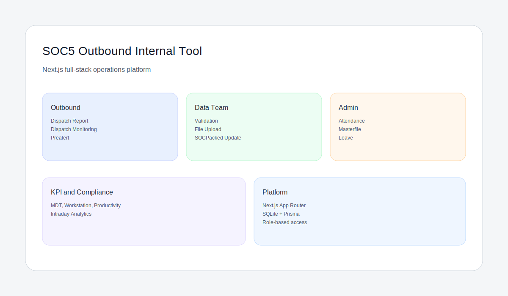

# Outbound Internal Tool

SOC5's outbound internal tool rebuilt as a full-stack Next.js application. The system centralizes dispatch reporting, real-time monitoring, KPI visibility, and admin workflows for the outbound operation.



## What this product does

- Consolidates outbound reporting, monitoring, and operational visibility in one interface.
- Supports multi-role workflows (Outbound, Data Team, Admin, KPI/Compliance, Midmile).
- Provides real-time operational views with validated data entry and audit-friendly flows.
- Maintains a configurable theming system for day/night operations.

## Core capabilities

- Dispatch report entry with validation, autosave, and row-based submission flows.
- Live dispatch monitoring with status-driven KPIs.
- Prealert database search and filtering.
- KPI dashboards for MDT, workstation, productivity, and intraday analysis.
- Admin tools for attendance, masterfile, breaktime, leave, and workstation management.

## Dispatch Report deep dive

Route: `/outbound/dispatch-report`

Data entry table behaviors
- Column order: Batch #, Cluster Name, Station (Hub), Region, Count of TO, Total OID Loaded, Actual Docked Time, Dock #, Actual Depart Time, Name of Processor, LH Trip #, Plate #, Fleet Size, Assigned PIC / OPS Coor, Actions.
- Batch # auto-assigns based on row order; row reorder updates batch numbers.
- Cluster Name: autocomplete after 3 chars; selecting a cluster fetches hubs and auto-fills Station + Dock # + Region.
- Multi-hub cluster: auto-splits into N rows (inserted after current row), with a toast: "Cluster maps to N hubs - added N-1 row(s)."
- Station is auto-filled and draggable for row reorder.
- Dock # is auto-filled; user must check Dock Confirm per row before submit.
- Processor Name: autocomplete after 3 chars with dropdown selection.
- LH Trip #: uppercased; debounced lookup to auto-fill multiple fields (cluster, station, region, dock times, plate, fleet size, assigned ops).
- Plate #: uppercased on input.
- Fleet Size: select 4WH, 6WH, 10WH, CONTAINER.
- Actual Depart Time uses min = Actual Docked Time.

Drafts and autosave
- Drafts stored in localStorage key `drafts:{ops_id}:submit_report:{session_id}`.
- Autosave debounce defaults to 10s; retention is 7 days.
- Drafts load on entry and are cleared on successful submit.

Submit flow
- Requires logged-in user; empty rows are filtered out.
- Payload built from row fields and sent via `dispatchApi.submitRows`.
- Per-row submit results shown in UI; partial success supported.
- On success, new reports are stored to prealert cache as `Pending` with hub/batch metadata.
- Redirects to `/outbound/prealert` after a short countdown.

## Prealert deep dive

Routes:
- `/outbound/prealert` (Ops view)
- `/data-team/prealert` (Data Team/Admin view)

Core table behavior
- Filters: hub, status, date (default today), query (reporter, hub, batch, LH trip, plate).
- Pagination with page size 10/25/50.
- Summary cards for Pending, Acknowledged, Confirmed; clicking toggles status filter.
- Sidebar lists hubs and batches; batch click opens modal with matching reports.

Role-based actions
- Data Team view:
  - Take Ownership (assigns dataTeam + ops id if empty).
  - Acknowledge (Pending -> Acknowledged, sets ackBy/ackAt).
  - Pending Edit (requires reason; sets Pending_Edit and updates statusUpdatedAt).
  - Confirm (Acknowledged -> Confirmed, sets confirmedBy/confirmedAt and downloads CSV).
- Ops view:
  - If Pending_Edit and report belongs to the current user, allow resubmit with remarks.

Alarms and alerts
- Data Team: alarm + row blink when any Pending exists.
- Ops: alarm + row blink when a user-owned Pending_Edit exists.
- Alarm uses AudioContext beeps every 1.5s while active.

Automation
- Auto-assign ownership after 5 minutes in Pending if a Data Team user is logged in.
- Confirm triggers a CSV download with dispatch id, trip, hub, batch, plate, status, and confirmation metadata.

## Architecture at a glance

- Frontend: Next.js App Router with client components for interactive sections.
- Backend: SQLite with Prisma Client (no raw SQL in request handlers).
- Auth: Role-aware session handling with secure tokens.
- Observability: Health endpoint and structured logging hooks.


## Local setup (no Docker)

1) Install dependencies:
   ```bash
   npm install
   ```
2) Configure `.env` (see `.env.example`).
3) Create the SQLite schema:
   ```bash
   npx prisma db push
   ```
4) Generate Prisma client:
   ```bash
   npm run prisma:generate
   ```
5) Start the app:
   ```bash
   npm run dev
   ```

## Health, metrics, and keep‑alive

- `GET /api/health` (readiness + DB check)
- `GET /api/health/liveness` (lightweight liveness)
- `GET /api/ping` (safe keep‑alive)
- `GET /api/metrics` (Admin session or `METRICS_TOKEN`)

See `docs/RENDER_DEPLOYMENT.md` for Render keep‑awake and deployment steps.

## CI checks

```bash
npm run lint
npm run typecheck
npm test
npm run build
```

## Status

- Core UI and navigation are in place.
- Data integration paths are defined in the API layer.
- Feature expansion continues per the phased plan.

Last Updated: 2026-01-22
